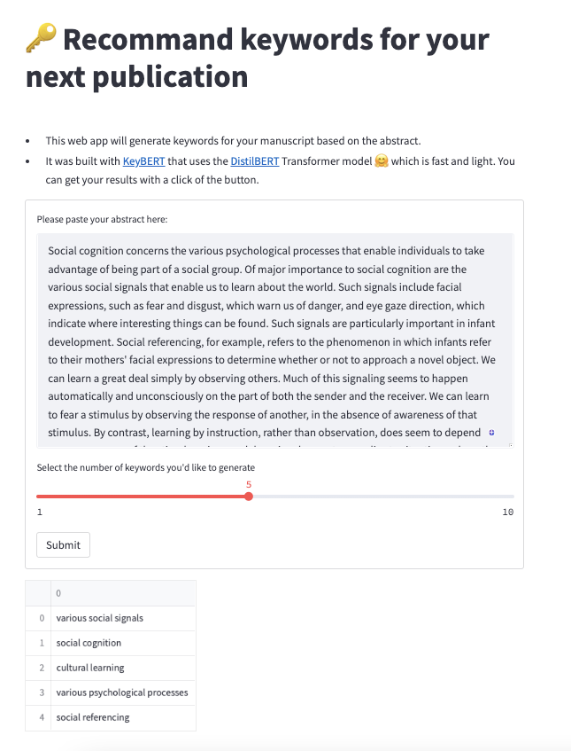

)

# Recommand key words for your next manuscript

- This web app will generate keywords for your manuscript based on the abstract. 
- It was built with [KeyBERT](https://github.com/MaartenGr/KeyBERT) that uses the [DistilBERT](https://huggingface.co/docs/transformers/model_doc/distilbert) Transformer model 🤗 which is fast and light. You can get your results with a click of the button.

